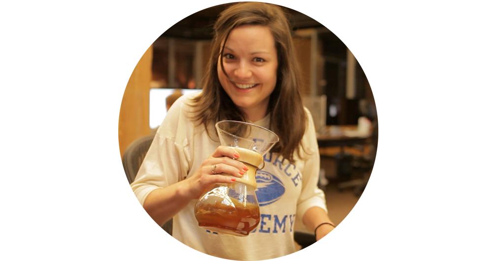

# Jessica Lord
## of the Warner Robins, Georgia Lords

I'm an urban designer turned open web developer—which isn't as odd as it sounds. I use technology to build tools to make the web more approachable.

I champion open knowledge, documentation, and kindness. [Open source is a privilege](/blog/osos-talk.html).

---

### Get in touch

[jess.lord@gmail.com](mailto: jess.lord@gmail.com) | [twitter/jllord](http://www.twitter.com/jllord) | [github/jlord](http://www.github.com/jlord) | [IRC](https://www.irccloud.com): freenode, #stackvm

**Talks/Workshops/Panels**

- [**EmpireConf**](http://2017.empireconf.org) — (Emcee) New York, October 2017
- [**ColdFront Conf**](https://www.youtube.com/watch?v=XWyIN7DUJOk) — Copenhagen, September 2017
- [**Greater Than Code**](https://www.greaterthancode.com/podcast/040-fck-it-and-be-nice) — Podcast, July 2017
- [**CSSConf EU**](http://2017.cssconf.eu) — (Emcee) Berlin, Germany, May 2017
- [**Render Conf**](http://2017.render-conf.com) — Oxford, England, March, 2017
- [**JSConf Australia**](http://2016.jsconfau.com/interviews/jessica-lord) — Melbourne, Australia, December, 2016
- [**CSSConf**](https://youtu.be/H6IDoraEpO0), Boston, September 2016
- [**JavaScript Air**](https://javascriptair.com/episodes/2016-07-06), Podcast, July, 2016
- [**Hanselminutes**](http://hanselminutes.com/534/creating-cross-platform-electron-apps-with-jessica-lord), Podcast, June, 2106
- [**GitHub Satellite**](https://www.youtube.com/watch?v=WVb2OD49pUA), Amsterdam, May, 2016
- [**Node Interactive**](https://www.youtube.com/watch?v=kdComTp7KsA), Portland, 2015
- **Mozilla Festival**, London, 2015
- [**GitHub Universe**](https://www.youtube.com/watch?v=_dkeD3OZ218), San Francisco, 2015
- [**Open Source Open Society**](https://www.youtube.com/watch?v=0kWix0Krc9c), New Zealand, 2015
- **NICAR** workshop, Atlanta, 2015
- **Mozilla Festival**, London, 2014
- **JSDC**, Taipei, 2014
- **Web Rebels**, Oslo, 2014
- **JSFest**, San Francisco, 2014
- [**She++ TechStories**](https://www.youtube.com/watch?v=eHOGE00ar4U), 2014
- **Mozilla Festival**, London, 2013
- [**Aspen Institute, FOCAS**](http://www.aspeninstitute.org/policy-work/communications-society/FOCAS2013), Aspen, 2013
- **State of the Map**, Portland, 2012
- [**Code for America Summit**](http://www.youtube.com/watch?v=Q76bKK229aM), San Francisco, 2012
- **Farmhouse Conf**, Los Angeles, 2012

**Extracurricular**
- [StreetSmart](http://welcome.thinkstreetsmart.org), transportation data nonprofit, Board of Directors
- [Patchwork](http://patchwork.github.io), Git and GitHub for beginners, mentor.
- [NodeSchool](http://www.nodeschool.io), Node.js fundamentals, mentor.

**Work**

- **MongoDB**, Engineer, 2017-Present
- **GitHub, Inc**, Engineer, 2013-2016
- **Mozilla-Knight Open News Code Sprint**, 2013, 2 months, Sheetsee.js
- **DIY.org**, 2013, Maker-in-Residence, Skills curriculum, 3 months, San Francisco
- **Code for America**, 2012, Fellow, San Francisco
- **Boston Planning & Development**, 2008-2011, Jr. Urban Designer, City of Boston
- **Rutledge-Alcock Architects**, 2007-2008, Intern Architect, Atlanta

**Education**

- **Georgia Institute of Technology**, 2007 Bachelor of Science, Architecture
- **Ecole d'Architecture de Paris LaVillette**, 2006

### About the Site

I built a [static site generator](http://www.github.com/jlord/balrog) and built [this site](http://www.github.com/jlord/jlord.github.io). It took forever. Typefaces are [Lora](https://www.google.com/fonts/specimen/Lora), [Source Sans Pro](https://www.google.com/fonts/specimen/Source+Sans+Pro) and [Source Code Pro](http://www.google.com/fonts/specimen/Source+Code+Pro) from Google Web Fonts.
